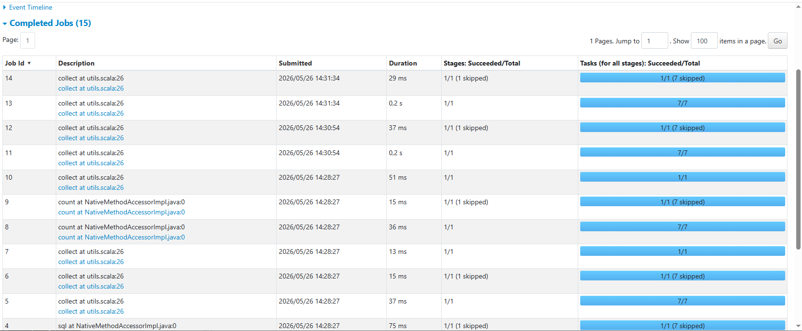

# Мета роботи

Освоїти сучасний інструмент для роботи з великими обсягами даних (Big Data) у розподіленому середовищі Apache Spark. Навчитися використовувати R-інтерфейс `sparklyr` для підключення до локального кластера, завантаження масивів даних та виконання складних агрегацій і фільтрацій за допомогою синтаксису `dplyr` без перевантаження оперативної пам'яті комп'ютера.

# Вступ

При роботі з логістичними даними, що налічують сотні тисяч або мільйони рядків, класичні інструменти можуть працювати повільно. Apache Spark вирішує цю проблему завдяки розподіленим обчисленням. У цій роботі ми проаналізуємо логістичну мережу за 2024 рік, використовуючи Spark як обчислювальний рушій.

# Хід виконання

## Підготовка середовища

```{r}
#| message: false
#| warning: false
library(sparklyr)
library(dplyr)
```

# Етап 1: Встановлення та підключення до Spark

На першому етапі нам необхідно налаштувати локальний кластер. Якщо Spark ще не встановлено, ми використовуємо команду spark_install() (достатньо виконати один раз). Потім ми створюємо об'єкт підключення sc, який з'єднує нашу сесію R з локальним кластером Spark версії 3.3.2.

```{r}
# 1. Створюємо конфігурацію і кажемо зберігати логи у поточній робочій папці
conf <- spark_config()
conf$sparklyr.log.dir <- getwd()

# 2. Підключаємось до кластера, використовуючи цю нову конфігурацію
sc <- spark_connect(master = "local", version = "3.3.2", config = conf)

# 3. Перевірка успішного підключення
print(sc)
```

# Етап 2: Завантаження даних

Далі ми завантажимо наш великий файл logistics_2024.csv. Важливо зазначити, що ми використовуємо спеціальну функцію spark_read_csv(), яка завантажує дані безпосередньо в пам'ять Spark, оминаючи локальну оперативну пам'ять R. Переконаємося, що дані завантажились успішно, підрахувавши кількість рядків.

```{r}

spark_logistics <- spark_read_csv(
  sc, 
  name = "logistics_table", 
  path = "logistics_2024.csv",
  header = TRUE,
  infer_schema = TRUE
)


cat("Кількість рядків у таблиці Spark:", sdf_nrow(spark_logistics), "\n")


glimpse(spark_logistics)
```

# Етап 3: Аналіз через dplyr-інтерфейс

На цьому етапі ми проведемо основний аналіз. За допомогою синтаксису dplyr ми виконаємо такі дії: 1. Обчислимо фактичний час доставки у днях (використовуючи вбудовану в Spark SQL функцію datediff). 2. Відфільтруємо лише проблемні замовлення (де час доставки перевищує 5 днів). 3. Згрупуємо дані за складами та знайдемо середній час таких затримок. 4. Відсортуємо склади від найгіршого до кращого і виберемо Топ-5.

```{r}

top_worst_warehouses_query <- spark_logistics %>%
  mutate(delivery_time = datediff(to_date(delivery_date), to_date(dispatch_date))) %>%
  filter(delivery_time > 5) %>%
  group_by(warehouse_id) %>%
  summarise(
    mean_delivery_time = mean(delivery_time, na.rm = TRUE),
    late_deliveries_count = n()
  ) %>%
  arrange(desc(mean_delivery_time)) %>%
  head(5)

print(top_worst_warehouses_query)
```

# Етап 4: Отримання результатів у R

Тепер нам потрібно матеріалізувати результати. Оскільки агрегована таблиця Топ-5 складів дуже мала, ми можемо безпечно завантажити її з кластера Spark назад у локальне середовище R. Для цього ми застосовуємо функцію collect(). Після цього об'єкт стає звичайним data.frame.

```{r}
top_worst_warehouses_local <- top_worst_warehouses_query %>% collect()
cat("Клас фінального об'єкта:", class(top_worst_warehouses_local)[1], "\n\n")
print("Топ-5 складів з найбільшим середнім часом затримок (> 5 днів):")
print(top_worst_warehouses_local)
```

# Етап 5: Моніторинг через веб-інтерфейс

Для того, щоб переконатися, що обчислення дійсно відбувалися у розподіленому середовищі, ми відкриємо вбудований веб-інтерфейс Spark UI. У ньому можна перевірити використання пам'яті (вкладка Storage), виконані задачі (вкладка Jobs) та навантаження на систему (вкладка Executors).

```{r}
spark_web(sc)
```

::: {layout-ncol="1"}
{#fig-spark-ui fig-align="center" width="90%"}
:::

## Етап 6: Від’єднання

Коректно від’єднайтеся від кластера через `spark_disconnect(sc)`.

```{r}
spark_disconnect(sc)
```

# Висновок

У ході виконання лабораторної роботи було успішно налаштовано середовище Apache Spark та здійснено підключення через пакет sparklyr. Застосування "лінивих" обчислень та синтаксису dplyr дозволило ефективно проаналізувати масив даних із понад 600 000 рядків, оминаючи обмеження оперативної пам'яті R.
